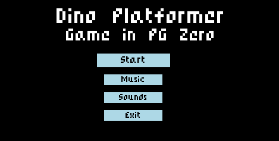
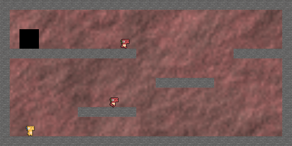

# Dino Platformer

**Dino Platformer** é um jogo de exemplo do gênero *platformer* (plataforma) feito utilizando apenas a biblioteca **[PyGame Zero](https://pygame-zero.readthedocs.io/en/stable/)**. 
Este projeto foi demonstra como construir um pequeno jogo 2D com movimentação, colisões, inimigos e lógica básica de vitória/derrota.




## Sobre o Jogo

Você é um pequeno dinossauro, o objetivo é eliminar os inimigos pulando sobre eles e chegar até a porta de saída. O jogo possui **apenas uma fase**, mas já conta com movimentação, pulo, colisões e efeitos sonoros.

### Futuras melhorias (ideias):
- Adição de fases
- Sistema de pontuação
- Moedas e itens colecionáveis
- Fases com desafios progressivos

## Controles

- **Setas Esquerda/Direita** – mover o personagem
- **Espaço** – pular
- **Mouse** – clicar em botões nos menus

## Recursos Utilizados

- **Sprites dos personagens:**  
  [arks.itch.io/dino-characters](https://arks.itch.io/dino-characters)
- **Efeitos sonoros e música:**  
  [kenney.nl/assets](https://kenney.nl/assets/category:Audio?sort=update)


## Como Rodar

1. Certifique-se de ter o **Python 3** instalado.
2. Instale o PyGame Zero com o seguinte comando:

```bash
pip install pgzero
```

3. Certifique-se de estar no diretório do jogo e execute o jogo com um dos comandos abaixo:

```bash
python main.py
# ou
pgzrun main.py
```

_(É recomendável usar `pgzrun` para garantir compatibilidade total com a estrutura do PG Zero.)_